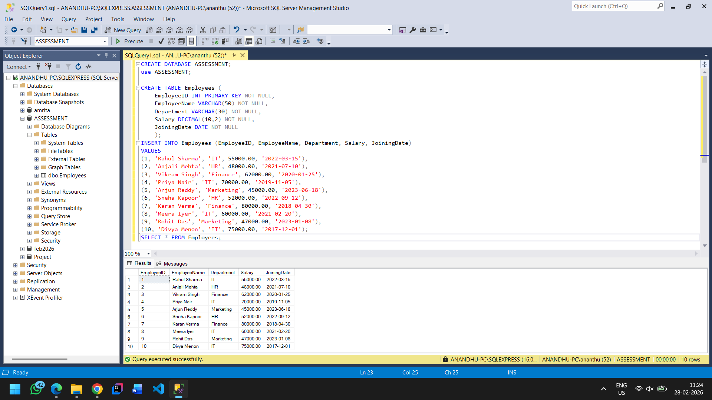
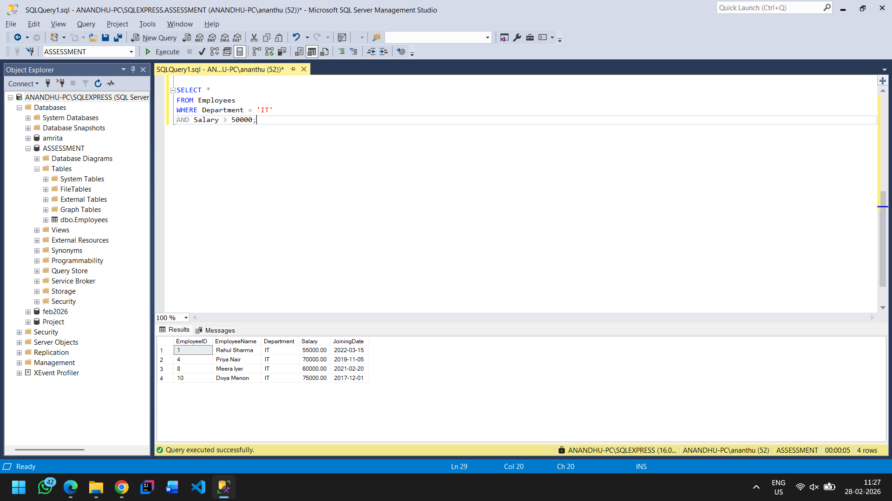
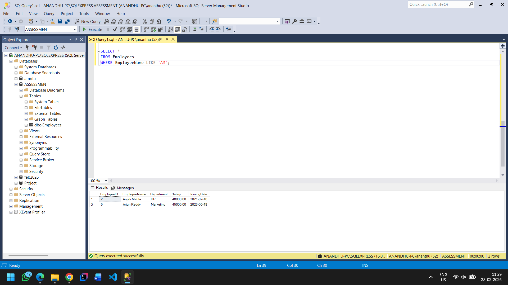
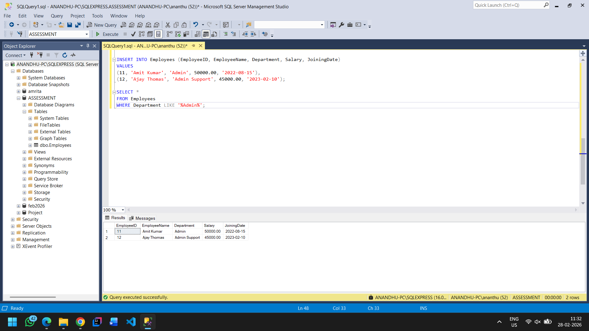
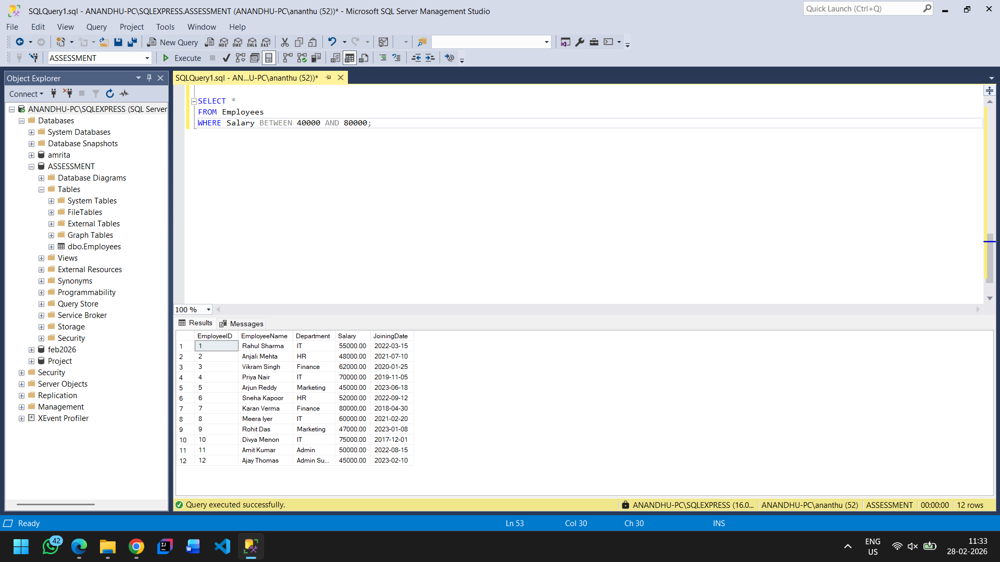
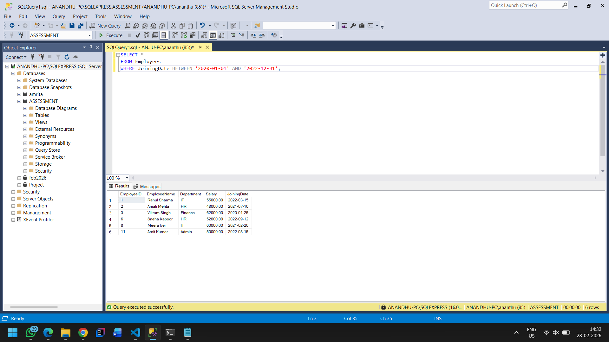

# Assessment 1: AND, OR, LIKE, and BETWEEN Operators

## Requirement

Develop a query system for an employee database that can filter employee records using the AND, OR, LIKE, and BETWEEN operators.

---

## Table Details

### Employees Table

| Column | Data Type | Constraints |
|--------|-----------|-------------|
| EmployeeID | INT | Primary Key, NOT NULL |
| EmployeeName | VARCHAR(50) | NOT NULL |
| Department | VARCHAR(30) | NOT NULL |
| Salary | DECIMAL(10,2) | NOT NULL |
| JoiningDate | DATE | NOT NULL |

---

## Database & Table Setup

### Creating Database and Table

```sql
CREATE DATABASE ASSESSMENT;
USE ASSESSMENT;

CREATE TABLE Employees (
    EmployeeID INT PRIMARY KEY NOT NULL,
    EmployeeName VARCHAR(50) NOT NULL, 
    Department VARCHAR(30) NOT NULL, 
    Salary DECIMAL(10,2) NOT NULL,
    JoiningDate DATE NOT NULL
);
```

### Inserting Sample Data

```sql
INSERT INTO Employees (EmployeeID, EmployeeName, Department, Salary, JoiningDate)
VALUES
(1, 'Rahul Sharma', 'IT', 55000.00, '2022-03-15'),
(2, 'Anjali Mehta', 'HR', 48000.00, '2021-07-10'),
(3, 'Vikram Singh', 'Finance', 62000.00, '2020-01-25'),
(4, 'Priya Nair', 'IT', 70000.00, '2019-11-05'),
(5, 'Arjun Reddy', 'Marketing', 45000.00, '2023-06-18'),
(6, 'Sneha Kapoor', 'HR', 52000.00, '2022-09-12'),
(7, 'Karan Verma', 'Finance', 80000.00, '2018-04-30'),
(8, 'Meera Iyer', 'IT', 60000.00, '2021-02-20'),
(9, 'Rohit Das', 'Marketing', 47000.00, '2023-01-08'),
(10, 'Divya Menon', 'IT', 75000.00, '2017-12-01');
```

### View All Employees

```sql
SELECT * FROM Employees;
```

**Screenshot:**



---

## Task 1: AND/OR Operator Query

### 1.1 Employees in 'IT' department AND salary greater than $50,000

**Query:**

```sql
SELECT *
FROM Employees
WHERE Department = 'IT'
AND Salary > 50000;
```

**Screenshot:**



---

### 1.2 Employees in 'HR' OR 'Finance' department

**Query:**

```sql
SELECT *
FROM Employees
WHERE Department = 'HR'
   OR Department = 'Finance';
```

**Screenshot:**


---

## Task 2: LIKE Operator Query

### 2.1 Employees whose name starts with 'A'

**Query:**

```sql
SELECT * 
FROM Employees
WHERE EmployeeName LIKE 'A%';
```

**Screenshot:**



---

### 2.2 Employees whose department contains 'Admin' (case insensitive)

**Adding Additional Sample Data:**

```sql
INSERT INTO Employees (EmployeeID, EmployeeName, Department, Salary, JoiningDate)
VALUES
(11, 'Amit Kumar', 'Admin', 50000.00, '2022-08-15'),
(12, 'Ajay Thomas', 'Admin Support', 45000.00, '2023-02-10');
```

**Query:**

```sql
SELECT *
FROM Employees
WHERE Department LIKE '%Admin%';
```

**Screenshot:**



---

## Task 3: BETWEEN Operator Query

### 3.1 Employees with salary between $40,000 and $80,000

**Query:**

```sql
SELECT *
FROM Employees
WHERE Salary BETWEEN 40000 AND 80000;
```

**Screenshot:**



---

### 3.2 Employees who joined between '2020-01-01' and '2022-12-31'

**Query:**

```sql
SELECT *
FROM Employees
WHERE JoiningDate BETWEEN '2020-01-01' AND '2022-12-31';
```

**Screenshot:**



---

## Summary

| Operator | Use Case |
|----------|----------|
| AND | Combines multiple conditions where all must be true |
| OR / IN | Returns rows where at least one condition is true |
| LIKE | Pattern matching with wildcards (%, _) |
| BETWEEN | Filters values within a specified range (inclusive) |

---

## Author

Orion Innovation Training Participant
