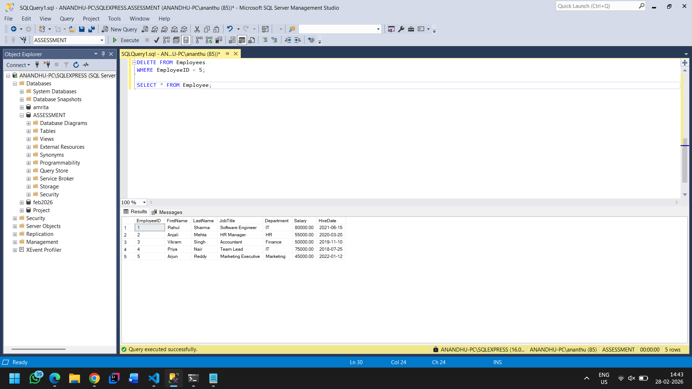
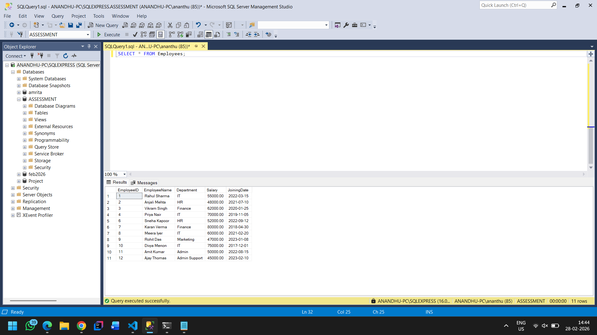
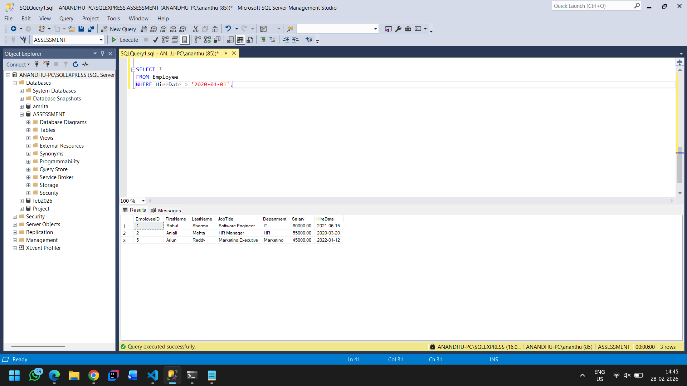
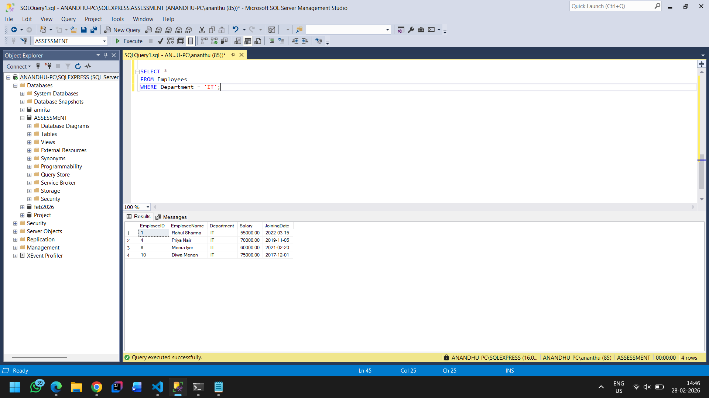

# Assessment 2: Employee Management System

## Problem Statement

Create and manipulate tables to manage employee data in an organization. The tasks include creating tables, inserting data, updating records, deleting records, and querying data using SELECT statements.

---

## Database Schema

### Employees Table

| Column | Data Type | Constraints |
|--------|-----------|-------------|
| EmployeeID | INT | Primary Key, Auto Increment |
| FirstName | VARCHAR(255) | - |
| LastName | VARCHAR(255) | - |
| JobTitle | VARCHAR(255) | - |
| Department | VARCHAR(255) | - |
| Salary | DECIMAL(10,2) | - |
| HireDate | DATE | - |

---

## Task 1: Create Table

**Query:**

```sql
CREATE TABLE Employee (
    EmployeeID INT PRIMARY KEY IDENTITY(1,1),
    FirstName VARCHAR(255),
    LastName VARCHAR(255),
    JobTitle VARCHAR(255),
    Department VARCHAR(255),
    Salary DECIMAL(10,2),
    HireDate DATE
);
```


## Task 2: Insert Data

**Query:**

```sql
INSERT INTO Employee (FirstName, LastName, JobTitle, Department, Salary, HireDate)
VALUES
('Rahul', 'Sharma', 'Software Engineer', 'IT', 60000.00, '2021-06-15'),
('Anjali', 'Mehta', 'HR Manager', 'HR', 55000.00, '2020-03-20'),
('Vikram', 'Singh', 'Accountant', 'Finance', 50000.00, '2019-11-10'),
('Priya', 'Nair', 'Team Lead', 'IT', 75000.00, '2018-07-25'),
('Arjun', 'Reddy', 'Marketing Executive', 'Marketing', 45000.00, '2022-01-12');
```

**View All Records:**

```sql
SELECT * FROM Employee;
```

**Screenshot:**


---

## Task 3: Update Data

Update the salary of an employee (EmployeeID = 1).

**Query:**

```sql
UPDATE Employee
SET Salary = 80000.00
WHERE EmployeeID = 1;
```

**View Updated Records:**

```sql
SELECT * FROM Employee;
```

**Screenshot:**


---

## Task 4: Delete Data

Delete an employee record (EmployeeID = 5).

**Query:**

```sql
DELETE FROM Employee
WHERE EmployeeID = 5;
```

**View Records After Deletion:**

```sql
SELECT * FROM Employee;
```

**Screenshot:**



---

## Task 5: Select Data

### 5.1 Retrieve All Records

**Query:**

```sql
SELECT * FROM Employee;
```

**Screenshot:**



---

### 5.2 Retrieve Employees with Salary Greater than $60,000

**Query:**

```sql
SELECT *
FROM Employee
WHERE Salary > 60000;
```

**Screenshot:**


---

### 5.3 Retrieve Employees Hired After '2020-01-01'

**Query:**

```sql
SELECT *
FROM Employee
WHERE HireDate > '2020-01-01';
```

**Screenshot:**



---

### 5.4 Retrieve Employees in 'IT' Department

**Query:**

```sql
SELECT *
FROM Employee
WHERE Department = 'IT';
```

**Screenshot:**



---

## Summary

| Operation | SQL Command | Description |
|-----------|-------------|-------------|
| CREATE | `CREATE TABLE` | Creates a new table in the database |
| INSERT | `INSERT INTO` | Adds new records to the table |
| UPDATE | `UPDATE SET` | Modifies existing records |
| DELETE | `DELETE FROM` | Removes records from the table |
| SELECT | `SELECT FROM WHERE` | Retrieves data with optional filtering |

---

## Author

Orion Innovation Training Participant
