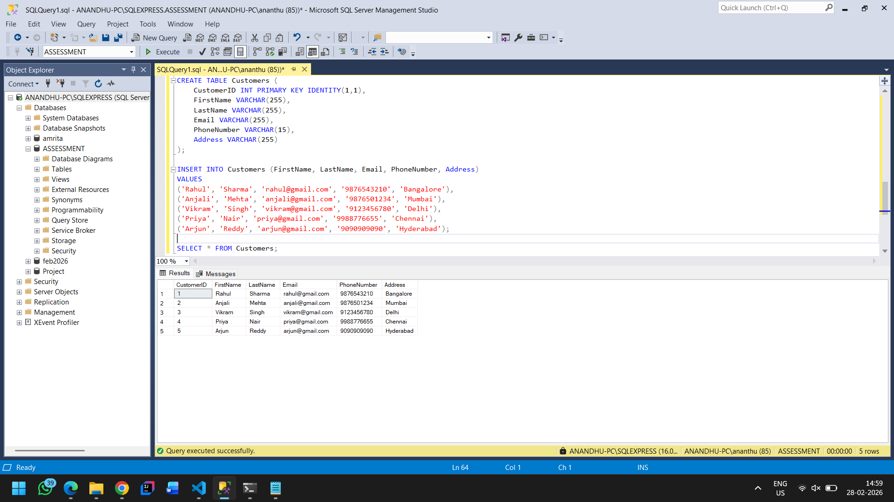
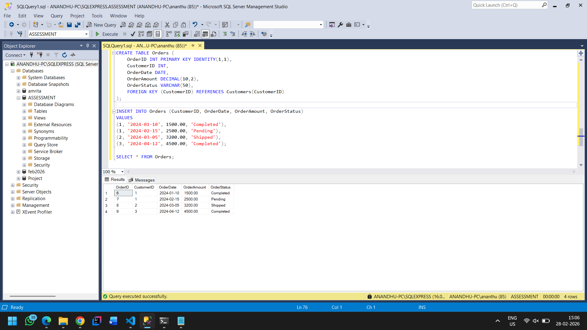
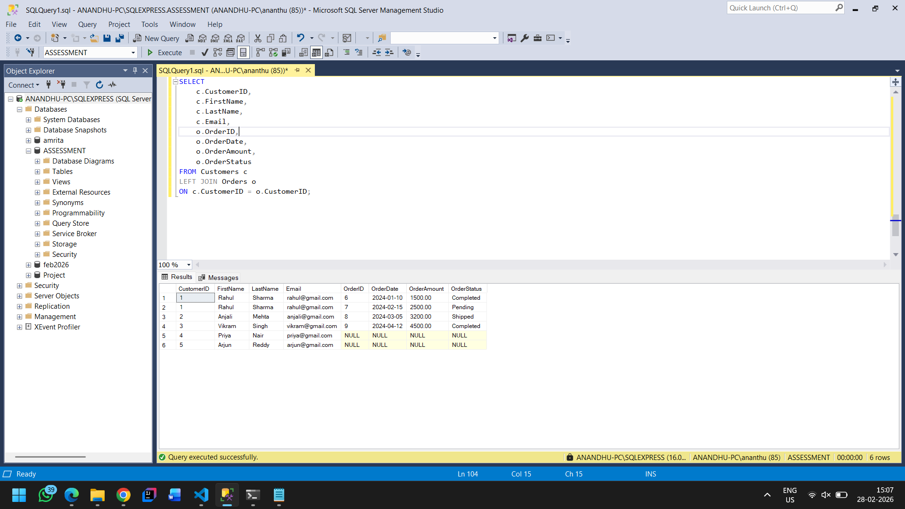
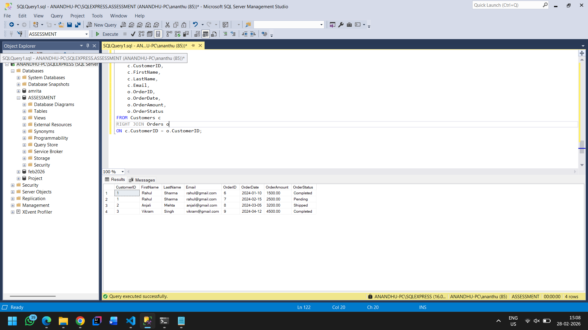
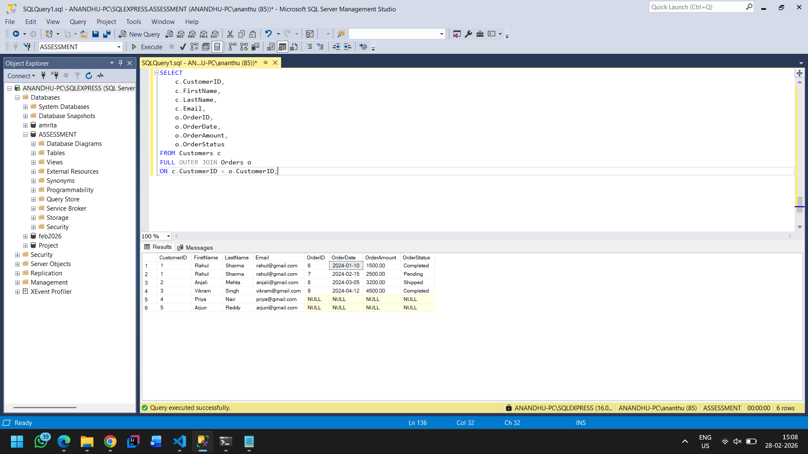

# Assessment 3: Customer Order Management System

## Problem Statement

Create a query to retrieve detailed order information for customers. The query should join the customers and orders tables to produce a result set that includes customer details and their corresponding order details.

---

## Database Schema

### Customers Table

| Column | Data Type | Constraints |
|--------|-----------|-------------|
| CustomerID | INT | Primary Key, Auto Increment |
| FirstName | VARCHAR(255) | - |
| LastName | VARCHAR(255) | - |
| Email | VARCHAR(255) | - |
| PhoneNumber | VARCHAR(15) | - |
| Address | VARCHAR(255) | - |

### Orders Table

| Column | Data Type | Constraints |
|--------|-----------|-------------|
| OrderID | INT | Primary Key, Auto Increment |
| CustomerID | INT | Foreign Key |
| OrderDate | DATE | - |
| OrderAmount | DECIMAL(10,2) | - |
| OrderStatus | VARCHAR(50) | - |

---

## Table Setup

### Creating Customers Table

**Query:**

```sql
CREATE TABLE Customers (
    CustomerID INT PRIMARY KEY IDENTITY(1,1),
    FirstName VARCHAR(255),
    LastName VARCHAR(255),
    Email VARCHAR(255),
    PhoneNumber VARCHAR(15),
    Address VARCHAR(255)
);
```

### Inserting Data into Customers

**Query:**

```sql
INSERT INTO Customers (FirstName, LastName, Email, PhoneNumber, Address)
VALUES
('Rahul', 'Sharma', 'rahul@gmail.com', '9876543210', 'Bangalore'),
('Anjali', 'Mehta', 'anjali@gmail.com', '9876501234', 'Mumbai'),
('Vikram', 'Singh', 'vikram@gmail.com', '9123456780', 'Delhi'),
('Priya', 'Nair', 'priya@gmail.com', '9988776655', 'Chennai'),
('Arjun', 'Reddy', 'arjun@gmail.com', '9090909090', 'Hyderabad');
```

**View Customers:**

```sql
SELECT * FROM Customers;
```

**Screenshot:**



---

### Creating Orders Table

**Query:**

```sql
CREATE TABLE Orders (
    OrderID INT PRIMARY KEY IDENTITY(1,1),
    CustomerID INT,
    OrderDate DATE,
    OrderAmount DECIMAL(10,2),
    OrderStatus VARCHAR(50),
    FOREIGN KEY (CustomerID) REFERENCES Customers(CustomerID)
);
```

### Inserting Data into Orders

**Query:**

```sql
INSERT INTO Orders (CustomerID, OrderDate, OrderAmount, OrderStatus)
VALUES
(1, '2024-01-10', 1500.00, 'Completed'),
(1, '2024-02-15', 2500.00, 'Pending'),
(2, '2024-03-05', 3200.00, 'Shipped'),
(3, '2024-04-12', 4500.00, 'Completed');
```

**View Orders:**

```sql
SELECT * FROM Orders;
```

**Screenshot:**



---

## SQL Joins

### 1. INNER JOIN

Retrieve a list of all customers who have placed orders, including customer details and order details.

**Query:**

```sql
SELECT 
    c.CustomerID,
    c.FirstName,
    c.LastName,
    c.Email,
    o.OrderID,
    o.OrderDate,
    o.OrderAmount,
    o.OrderStatus
FROM Customers c
INNER JOIN Orders o
ON c.CustomerID = o.CustomerID;
```

**Screenshot:**


---

### 2. LEFT JOIN

Retrieve a list of all customers and their orders, including those who have not placed any orders.

**Query:**

```sql
SELECT 
    c.CustomerID,
    c.FirstName,
    c.LastName,
    c.Email,
    o.OrderID,
    o.OrderDate,
    o.OrderAmount,
    o.OrderStatus
FROM Customers c
LEFT JOIN Orders o
ON c.CustomerID = o.CustomerID;
```

**Screenshot:**



---

### 3. RIGHT JOIN

Retrieve a list of all orders and the corresponding customer details, including orders without customer information (in case of data issues).

**Query:**

```sql
SELECT 
    c.CustomerID,
    c.FirstName,
    c.LastName,
    c.Email,
    o.OrderID,
    o.OrderDate,
    o.OrderAmount,
    o.OrderStatus
FROM Customers c
RIGHT JOIN Orders o
ON c.CustomerID = o.CustomerID;
```

**Screenshot:**



---

### 4. FULL OUTER JOIN

Retrieve a list of all customers and all orders, including those without matching entries.

**Query:**

```sql
SELECT 
    c.CustomerID,
    c.FirstName,
    c.LastName,
    c.Email,
    o.OrderID,
    o.OrderDate,
    o.OrderAmount,
    o.OrderStatus
FROM Customers c
FULL OUTER JOIN Orders o
ON c.CustomerID = o.CustomerID;
```

**Screenshot:**



---

## Summary

| Join Type | Description |
|-----------|-------------|
| INNER JOIN | Returns only matching rows from both tables |
| LEFT JOIN | Returns all rows from left table + matching rows from right table |
| RIGHT JOIN | Returns all rows from right table + matching rows from left table |
| FULL OUTER JOIN | Returns all rows from both tables, with NULLs where no match |

---

## Author

Ananthu M
