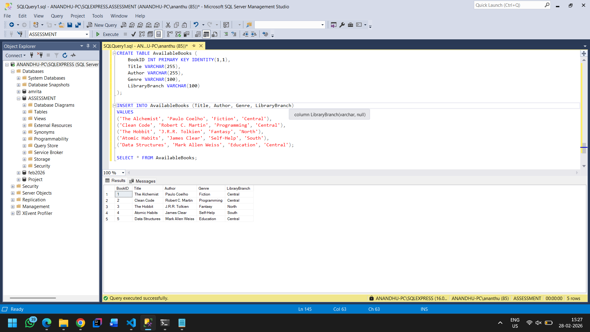
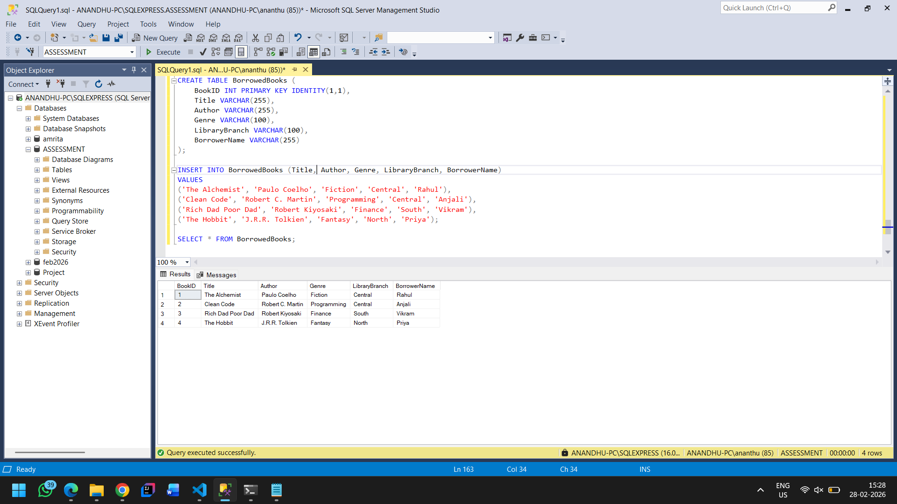
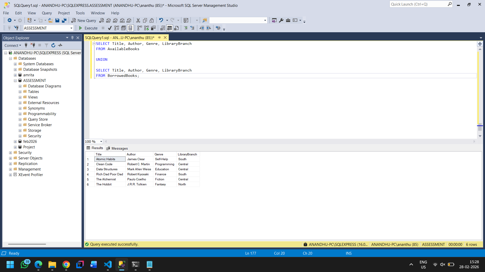
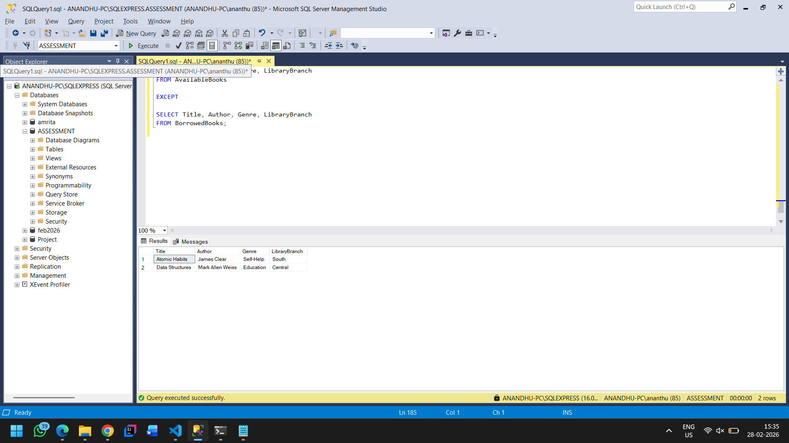

# Assessment 4: Library Management System

## Problem Statement

Create queries using SQL set operators to manage and retrieve data from the library's database. The queries should retrieve lists of books that meet various criteria using UNION, INTERSECT, and EXCEPT set operators.

---

## Database Schema

### AvailableBooks Table

| Column | Data Type | Constraints |
|--------|-----------|-------------|
| BookID | INT | Primary Key, Auto Increment |
| Title | VARCHAR(255) | - |
| Author | VARCHAR(255) | - |
| Genre | VARCHAR(100) | - |
| LibraryBranch | VARCHAR(100) | - |

### BorrowedBooks Table

| Column | Data Type | Constraints |
|--------|-----------|-------------|
| BookID | INT | Primary Key, Auto Increment |
| Title | VARCHAR(255) | - |
| Author | VARCHAR(255) | - |
| Genre | VARCHAR(100) | - |
| LibraryBranch | VARCHAR(100) | - |
| BorrowerName | VARCHAR(255) | - |

---

## Table Setup

### Creating AvailableBooks Table

**Query:**

```sql
CREATE TABLE AvailableBooks (
    BookID INT PRIMARY KEY IDENTITY(1,1),
    Title VARCHAR(255),
    Author VARCHAR(255),
    Genre VARCHAR(100),
    LibraryBranch VARCHAR(100)
);
```

### Inserting Data into AvailableBooks

**Query:**

```sql
INSERT INTO AvailableBooks (Title, Author, Genre, LibraryBranch)
VALUES
('The Alchemist', 'Paulo Coelho', 'Fiction', 'Central'),
('Clean Code', 'Robert C. Martin', 'Programming', 'Central'),
('The Hobbit', 'J.R.R. Tolkien', 'Fantasy', 'North'),
('Atomic Habits', 'James Clear', 'Self-Help', 'South'),
('Data Structures', 'Mark Allen Weiss', 'Education', 'Central');
```

**View AvailableBooks:**

```sql
SELECT * FROM AvailableBooks;
```

**Screenshot:**



---

### Creating BorrowedBooks Table

**Query:**

```sql
CREATE TABLE BorrowedBooks (
    BookID INT PRIMARY KEY IDENTITY(1,1),
    Title VARCHAR(255),
    Author VARCHAR(255),
    Genre VARCHAR(100),
    LibraryBranch VARCHAR(100),
    BorrowerName VARCHAR(255)
);
```

### Inserting Data into BorrowedBooks

**Query:**

```sql
INSERT INTO BorrowedBooks (Title, Author, Genre, LibraryBranch, BorrowerName)
VALUES
('The Alchemist', 'Paulo Coelho', 'Fiction', 'Central', 'Rahul'),
('Clean Code', 'Robert C. Martin', 'Programming', 'Central', 'Anjali'),
('Rich Dad Poor Dad', 'Robert Kiyosaki', 'Finance', 'South', 'Vikram'),
('The Hobbit', 'J.R.R. Tolkien', 'Fantasy', 'North', 'Priya');
```

**View BorrowedBooks:**

```sql
SELECT * FROM BorrowedBooks;
```

**Screenshot:**



---

## SQL Set Operators

### 1. UNION

Retrieve a list of all books (both available and borrowed) without duplicates.

**Query:**

```sql
SELECT Title, Author, Genre, LibraryBranch
FROM AvailableBooks

UNION

SELECT Title, Author, Genre, LibraryBranch
FROM BorrowedBooks;
```

**Screenshot:**



---

### 2. INTERSECT

Retrieve a list of books that are both available and borrowed (if applicable).

**Query:**

```sql
SELECT Title, Author, Genre, LibraryBranch
FROM AvailableBooks

INTERSECT

SELECT Title, Author, Genre, LibraryBranch
FROM BorrowedBooks;
```

**Screenshot:**


---

### 3. EXCEPT

Retrieve a list of books that are available but not borrowed.

**Query:**

```sql
SELECT Title, Author, Genre, LibraryBranch
FROM AvailableBooks

EXCEPT

SELECT Title, Author, Genre, LibraryBranch
FROM BorrowedBooks;
```

**Screenshot:**



---

## Summary

| Set Operator | Description |
|--------------|-------------|
| UNION | Combines results from two queries, removing duplicates |
| INTERSECT | Returns only rows that appear in both query results |
| EXCEPT | Returns rows from the first query that are not in the second query |

---

## Author

Ananthu M

